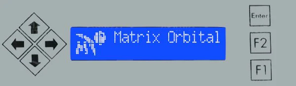

# Proxmox LCD Matrix Orbital Display 🚀

An interactive system monitoring script for **Proxmox VE** designed to output real-time hardware status to a physical **Matrix Orbital MX2 USB** LCD screen. 

This project features a fully automated, interactive installation wizard that configures the hardware, system dependencies, localized language preferences, and optional cluster monitoring node environments.

---

## 🕹️ Screen Button Controls



| Button | Action |
| :--- | :--- |
| **Left / Right** | Next screen |
| **Up / Down** | Setting backlight |
| **Enter** | Enter in the menu |
| **F1** | Main menu |
| **F2** | Back to clock |

---

## ✨ Features

* 📊 **Real-time Metrics:** Displays CPU usage, RAM utilization, system temperatures, and storage health (SMART).
* 🌐 **Localization:** Full support for both English (`EN`) and French (`FR`) display layouts.
* 🖥️ **Cluster Awareness:** Optional dedicated monitoring screens for nodes (e.g., PVE-02, PVE-03).
* 🔌 **Hardware Resilience:** Leverages unique device path identification (`/dev/serial/by-id/*`) to secure a stable connection, bypassing flaky standard virtual COM port allocations.
* ⚙️ **Systemd Integration:** Runs natively as a lightweight, background daemon managed by `systemd`.

---

## 🗺️ Menu Structure

```text
[Button : Left / Right] 🔄
├── 📶 1. NETWORK (Host / IP / Flow rate) 
├── ⚙️ 2. CPU (Name / Load / Temp)
├── 🧠 3. RAM (Used / Free / Swap)
├── 🖥️ 4. VM & LXC (VM / LXC run)
├── 🧮 5. STORAGE (ZFS / Network / Local / name and usage %)
├── 🏥 6. SMART HEALTH (SMART status and temp for sda, nvme0, etc.)
└── 🖥️ 7. CLUSTER (Only if ENABLE_CLUSTER_MENU = True)
    ├── Replication
    ├── Node 02 (Online Status)
    └── Node 03 (Online Status)
```

---

## 🚀 Quick Automated Installation

To deploy the script on a Proxmox node, execute the following command in your terminal. 

> ⚠️ **Important:** Do NOT pipe directly to bash (`curl | bash`), as the installer requires a TTY terminal allocation to process your interactive inputs (language preference, hardware ports, cluster IPs).

```bash
sudo bash <(curl -sSL https://raw.githubusercontent.com/Wouamm/proxmox-lcd-matrix-orbital/main/install.sh)
```

### 🎯 What the Installer Does:
1. Installs essential system prerequisites (`python3-serial`, `python3-psutil`, `smartmontools`, `lm-sensors`).
2. Downloads the latest revision of the core monitoring Python module.
3. Automatically scans your `/dev/serial/by-id/` registry to help you select the exact Matrix Orbital device.
4. Generates and triggers the native `/etc/systemd/system/proxmox-lcd.service` persistent daemon.

---

## 🛠️ Manual Adjustments

If you ever need to manually tweak variables (such as updating cluster node target IPs, modifying backlight timeouts, or adding disk prefix filters) after the deployment, simply edit the main module:

```bash
sudo nano /root/scripts/proxmox-lcd-matrix-orbital.py
```

Then restart the service to apply the updates:
```bash
sudo systemctl restart proxmox-lcd.service
```

---

## 🧹 Complete Uninstallation

Should you need to remove the tracking deployment entirely from your host hypervisor without wiping your entire `scripts` directory:

```bash
# Stop and remove the daemon
sudo systemctl stop proxmox-lcd.service
sudo systemctl disable proxmox-lcd.service
sudo rm /etc/systemd/system/proxmox-lcd.service
sudo systemctl daemon-reload

# Remove only the project files, keeping your other scripts safe
sudo rm -f /root/scripts/proxmox-lcd-matrix-orbital.py
```

---

## 🔍 Project Transparency & Disclaimer

For the sake of complete openness:
* **AI Collaboration:** This code and its automated installer were built together in tandem with **Gemini AI**.
* **Physical Testing:** Unlike purely theoretical code, every step, feature iteration, and menu behavior has been meticulously **tested on physical hardware** during development.
* **Developer Status:** I am **not a professional developer**. This project was created out of passion for home-lab automation.
* **Compatibility Warning:** This tool comes with **absolutely no guarantee** of flawless operation on other screen models from the Matrix Orbital brand. It was developed specifically to match the **Matrix Orbital MX2 USB** series interface and commands, and your mileage may vary depending on your exact hardware revision.

==============================================================================

# Affichage Proxmox LCD Matrix Orbital 🚀

Un script de surveillance système interactif pour **Proxmox VE**, conçu pour envoyer l'état du matériel en temps réel sur un **écran LCD physique Matrix Orbital MX2 USB**.

Ce projet intègre un assistant d'installation automatisé et interactif permettant de configurer le matériel, les dépendances système, la langue d'affichage et l'éventuelle surveillance d'un cluster de nœuds.

---

## 🕹️ Fonctions des touches


| Touches | Action |
| :--- | :--- |
| **Gauche / Droite** | Ecran suivant |
| **Haut / Bas** | Réglage du rétroéclairage |
| **Enter** | Entrer dans le menu |
| **F1** | Menu principal |
| **F2** | Retour sur l'horloge |

---

## ✨ Fonctionnalités

* 📊 **Métriques en temps réel :** Affiche la charge CPU, l'utilisation RAM, les températures du système et la santé des disques (SMART).
* 🌐 **Traduction :** Support complet pour les configurations d'affichage en Anglais (`EN`) et en Français (`FR`).
* 🖥️ **Gestion de Cluster :** Écrans dédiés optionnels pour surveiller les nœuds (ex: PVE-02, PVE-03).
* 🔌 **Stabilité Matérielle :** Utilise l'identification unique des périphériques (`/dev/serial/by-id/*`) pour garantir une connexion stable, évitant les sauts de ports COM virtuels instables.
* ⚙️ **Intégration Systemd :** S'exécute nativement en arrière-plan comme un service léger géré par `systemd`.

---

## 🗺️ Arborescence des Menus

```text
[Touche : Gauche / Droite] 🔄
├── 📶 1. RESEAU (Hote / IP / Débit) 
├── ⚙️ 2. CPU (Nom / Charge / Température)
├── 🧠 3. RAM (Utilisé / Libre / Swap)
├── 🖥️ 4. VM & LXC (Nombre de VM/LXC actifs)
├── 🧮 5. VOLUMETRIE (ZFS / Réseau / Local / nom et usage en %)
├── 🏥 6. SANTE SMART (Statut SMART et température pour sda, nvme0, etc.)
└── 🖥️ 7. CLUSTER (Uniquement si ENABLE_CLUSTER_MENU = True)
    ├── Réplication
    ├── Nœud 02 (Statut en ligne)
    └── Nœud 03 (Statut en ligne)
```

---

## 🚀 Installation Automatique Rapide

Pour déployer le script sur un nœud Proxmox, exécutez la commande suivante dans votre terminal.

> ⚠️ **Important :** Ne redirigez pas le flux directement vers bash (`curl | bash`), car l'installateur requiert l'attribution d'un terminal (TTY) pour capturer vos choix interactifs (langue, ports matériels, IPs du cluster).

```bash
sudo bash <(curl -sSL https://raw.githubusercontent.com/Wouamm/proxmox-lcd-matrix-orbital/main/install.sh)
```

### 🎯 Ce que fait l'installateur :
1. Installe les prérequis système indispensables (`python3-serial`, `python3-psutil`, `smartmontools`, `lm-sensors`).
2. Télécharge la dernière version du script Python principal.
3. Analyse automatiquement votre registre `/dev/serial/by-id/` pour vous aider à sélectionner votre écran Matrix Orbital.
4. Génère et active le service natif `/etc/systemd/system/proxmox-lcd.service`.

---

## 🛠️ Ajustements Manuels

Si vous devez modifier manuellement des variables après le déploiement (comme mettre à jour les IPs du cluster, ajuster la mise en veille du rétroéclairage ou filtrer des préfixes de disques), éditez simplement le script :

```bash
sudo nano /root/scripts/proxmox-lcd-matrix-orbital.py
```

Puis redémarrez le service pour appliquer les modifications :
```bash
sudo systemctl restart proxmox-lcd.service
```

---

## 🧹 Désinstallation Complète

Si vous souhaitez retirer complètement le projet de votre hyperviseur sans pour autant effacer tout votre dossier `scripts` :

```bash
# Arrêter et supprimer le service
sudo systemctl stop proxmox-lcd.service
sudo systemctl disable proxmox-lcd.service
sudo rm /etc/systemd/system/proxmox-lcd.service
sudo systemctl daemon-reload

# Supprimer uniquement le fichier du projet, sans toucher à vos autres scripts
sudo rm -f /root/scripts/proxmox-lcd-matrix-orbital.py
```

---

## 🔍 Transparence du projet & Avertissement

Par souci de transparence totale :
* **Collaboration IA :** Ce code et son script d'installation automatisé ont été développés main dans la main avec l'**IA Gemini**.
* **Tests Physiques :** Contrairement à du code purement théorique, chaque étape, chaque fonctionnalité et chaque comportement des menus a été méticuleusement **testé sur du matériel physique** tout au long du développement.
* **Profil de l'auteur :** Je ne suis **pas un développeur professionnel**. Ce projet est né de ma passion pour l'administration système et l'optimisation home-lab.
* **Limite de Compatibilité :** Ce script est fourni **sans aucune garantie de bon fonctionnement** sur d'autres modèles d'écrans de la marque Matrix Orbital. Il a été conçu spécifiquement pour répondre aux commandes et à l'interface de la série **Matrix Orbital MX2 USB** ; les résultats peuvent donc varier selon votre matériel.
